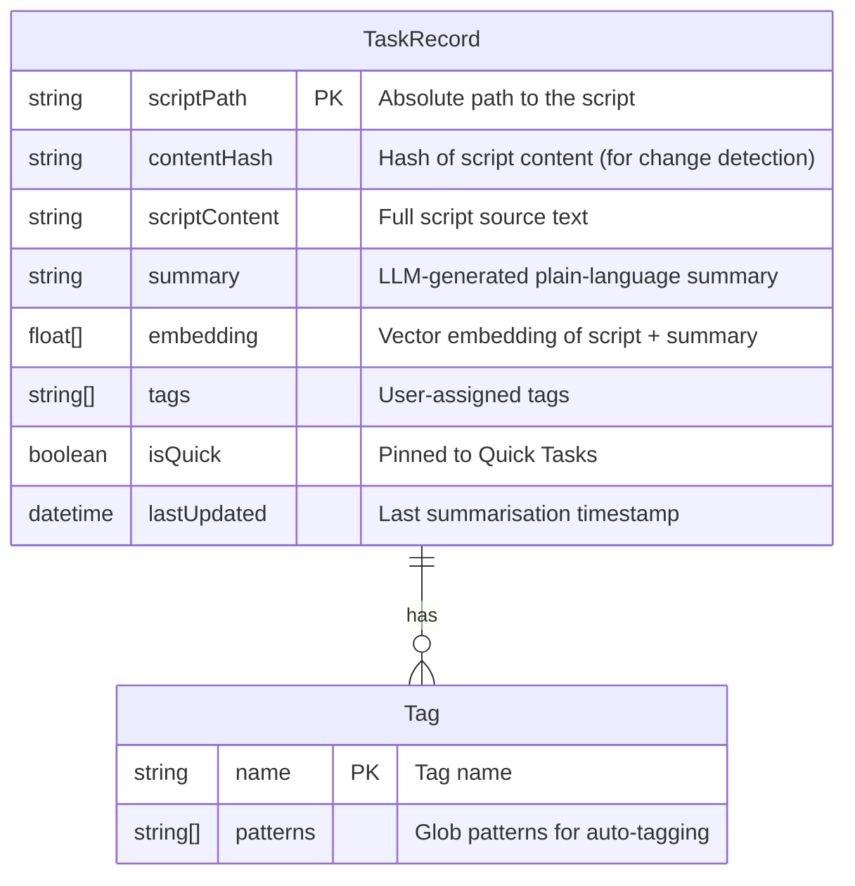

# CommandTree Specification

## Table of Contents

- [Overview](#overview)
- [Task Discovery](#task-discovery)
  - [Shell Scripts](#shell-scripts)
  - [NPM Scripts](#npm-scripts)
  - [Makefile Targets](#makefile-targets)
  - [Launch Configurations](#launch-configurations)
  - [VS Code Tasks](#vs-code-tasks)
  - [Python Scripts](#python-scripts)
- [Task Execution](#task-execution)
  - [Run in New Terminal](#run-in-new-terminal)
  - [Run in Current Terminal](#run-in-current-terminal)
  - [Debug](#debug)
- [Quick Tasks](#quick-tasks)
- [Tagging](#tagging)
  - [Tag Configuration File](#tag-configuration-file)
  - [Pattern Syntax](#pattern-syntax)
  - [Managing Tags](#managing-tags)
- [Filtering](#filtering)
  - [Text Filter](#text-filter)
  - [Tag Filter](#tag-filter)
  - [Clear Filter](#clear-filter)
- [Parameterized Tasks](#parameterized-tasks)
- [Settings](#settings)
  - [Exclude Patterns](#exclude-patterns)
  - [Sort Order](#sort-order)
  - [Show Empty Categories](#show-empty-categories)
- [User Data Storage](#user-data-storage)
- [Semantic Search (FUTURE FEATURE)](#semantic-search-future-feature)
  - [Overview](#overview-1)
  - [LLM Integration](#llm-integration)
  - [Database and Config Migration](#database-and-config-migration)
  - [Data Structure](#data-structure)
  - [Search UX](#search-ux)

---

## Overview
**overview**

CommandTree scans a VS Code workspace and surfaces all runnable tasks in a single tree view sidebar panel. It discovers shell scripts, npm scripts, Makefile targets, VS Code tasks, launch configurations, etc then presents them in a categorized, filterable tree.

## Task Discovery
**task-discovery**

CommandTree recursively scans the workspace for runnable tasks grouped by type. Discovery respects exclude patterns configured in settings. It does this in the background on low priority.

### Shell Scripts
**task-discovery/shell-scripts**

Discovers `.sh` files throughout the workspace. Supports optional `@param` and `@description` comments for metadata.

### NPM Scripts
**task-discovery/npm-scripts**

Reads `scripts` from all `package.json` files, including nested projects and subfolders.

### Makefile Targets
**task-discovery/makefile-targets**

Parses `Makefile` and `makefile` for named targets.

### Launch Configurations
**task-discovery/launch-configurations**

Reads debug configurations from `.vscode/launch.json`.

### VS Code Tasks
**task-discovery/vscode-tasks**

Reads task definitions from `.vscode/tasks.json`, including support for `${input:*}` variable prompts.

### Python Scripts
**task-discovery/python-scripts**

Discovers files with a `.py` extension.

## Task Execution
**task-execution**

Tasks can be executed three ways via inline buttons or context menu.

### Run in New Terminal
**task-execution/new-terminal**

Opens a new VS Code terminal and runs the task command. Triggered by the play button or `commandtree.run` command.

### Run in Current Terminal
**task-execution/current-terminal**

Sends the task command to the currently active terminal. Triggered by the circle-play button or `commandtree.runInCurrentTerminal` command.

### Debug
**task-execution/debug**

Launches the task using the VS Code debugger. Only applicable to launch configurations. Triggered by the bug button or `commandtree.debug` command.

## Quick Tasks
**quick-tasks**

Users can star tasks to pin them in a "Quick Tasks" panel at the top of the tree view. Starred task identifiers are persisted in the `quick` array inside `.vscode/commandtree.json`:

```json
{
  "quick": [
    "npm:build",
    "shell:/path/to/project/scripts/deploy.sh:deploy.sh"
  ]
}
```

## Tagging
**tagging**

Tags group related tasks for organization and filtering.

### Tag Configuration File
**tagging/config-file**

Tags are defined in `.vscode/commandtree.json` under the `tags` key:

```json
{
  "tags": {
    "build": ["npm:build", "npm:compile", "make:build"],
    "test": ["npm:test*", "Test:*"],
    "ci": ["npm:lint", "npm:test", "npm:build"]
  }
}
```

This file can be committed to version control to share task organization with a team.

### Pattern Syntax
**tagging/pattern-syntax**

| Pattern | Matches |
|---------|---------|
| `npm:build` | Exact match: npm script named "build" |
| `npm:test*` | Wildcard: npm scripts starting with "test" |
| `*deploy*` | Any task with "deploy" in the name |
| `type:shell:*` | All shell scripts |
| `type:npm:*` | All npm scripts |
| `type:make:*` | All Makefile targets |
| `type:launch:*` | All launch configurations |
| `**/scripts/**` | Path matching: tasks in any `scripts` folder |
| `shell:/full/path:name` | Exact task identifier (used internally for Quick Tasks) |

### Managing Tags
**tagging/management**

- **Add tag to task**: Right-click a task > "Add Tag" > select existing or create new
- **Remove tag from task**: Right-click a task > "Remove Tag"
- **Edit tags file directly**: Command Palette > "CommandTree: Edit Tags Configuration"

## Filtering
**filtering**

### Text Filter
**filtering/text**

Free-text filter via toolbar or `commandtree.filter` command. Matches against task names.

### Tag Filter
**filtering/tag**

Pick a tag from the toolbar picker (`commandtree.filterByTag`) to show only tasks matching that tag's patterns.

### Clear Filter
**filtering/clear**

Remove all active filters via toolbar button or `commandtree.clearFilter` command.

## Parameterized Tasks
**parameterized-tasks**

Shell scripts with parameter comments prompt the user for input before execution:

```bash
#!/bin/bash
# @description Deploy to environment
# @param environment Target environment (staging, production)

deploy_to "$1"
```

VS Code tasks using `${input:*}` variables prompt automatically via the built-in input UI.

## Settings
**settings**

All settings are configured via VS Code settings (`Cmd+,` / `Ctrl+,`).

### Exclude Patterns
**settings/exclude-patterns**

`commandtree.excludePatterns` - Glob patterns to exclude from task discovery. Default includes `**/node_modules/**`, `**/.vscode-test/**`, and others.

### Sort Order
**settings/sort-order**

`commandtree.sortOrder` - How tasks are sorted within categories:

| Value | Description |
|-------|-------------|
| `folder` | Sort by folder path, then alphabetically (default) |
| `name` | Sort alphabetically by task name |
| `type` | Sort by task type, then alphabetically |

### Show Empty Categories
**settings/show-empty-categories**

`commandtree.showEmptyCategories` - Whether to display category nodes that contain no discovered tasks.

## User Data Storage
**user-data-storage**

CommandTree stores workspace-specific data in `.vscode/commandtree.json`. This file is automatically created and updated as you use the extension. It holds both quick task pins and tag definitions.

---

## Semantic Search (FUTURE FEATURE)
**semantic-search**

> **⏳ FUTURE FEATURE** — This section describes a planned feature that is **not currently being implemented**. It is included here for design reference only.

### Overview
**semantic-search/overview**

CommandTree will use an LLM to generate a plain-language summary of what each discovered script does. These summaries, along with vector embeddings of the script content and summary, are stored in a local database. This enables **semantic search**: users can describe what they want in natural language and find the right script without knowing its exact name or path.

### LLM Integration
**semantic-search/llm-integration**

The preferred integration path is **GitHub Copilot** via the VS Code Language Model API (`vscode.lm`), which is stable since VS Code 1.90.

**Opt-in flow:**

1. On first workspace load (or when the user enables the feature), CommandTree shows a simple prompt:
   > *"Would you like to use GitHub Copilot to summarise scripts in your workspace?"*
2. If the user accepts, CommandTree uses `vscode.lm.selectChatModels({ vendor: 'copilot' })` to access a lightweight model (e.g. `gpt-4o-mini`) for summarisation. The VS Code API handles Copilot authentication and consent automatically.
3. If the user declines, the feature remains **dormant**. No summaries are generated, and the extension behaves as before. The user can enable it later via settings.

**Alternative providers:**

If the user chooses not to use GitHub copilot, or it is not available (no subscription, offline environment, user preference), the user can configure an alternative LLM provider at any time.

- A local model (e.g. Ollama, llama.cpp)
- Another VS Code language model provider registered via `vscode.lm.registerLanguageModelChatProvider()`

The summarisation interface is provider-agnostic — any model that accepts a text prompt and returns a text response can be used.

### Database and Config Migration
**semantic-search/database-migration**

All workspace configuration currently stored in `.vscode/commandtree.json` (quick task pins, tag definitions) will migrate into a **local embedded database** (e.g. SQLite). This database also stores script summaries and vector embeddings.

The migration is automatic and transparent. The `.vscode/commandtree.json` file is read once during migration, and the database becomes the single source of truth going forward.

### Data Structure
**semantic-search/data-structure**



- **`contentHash`** — When a script file changes, the hash no longer matches and the summary + embedding are regenerated.
- **`embedding`** — A dense vector produced by the same or a dedicated embedding model. Used for cosine similarity search.
- **`summary`** — A short (1-3 sentence) description of what the script does, generated by the LLM.

### Search UX
**semantic-search/search-ux**

The existing filter bar (`commandtree.filter`) gains a semantic search mode:

1. User types a natural-language query (e.g. *"deploy to staging"*, *"run database migrations"*, *"lint and format code"*).
2. The query is embedded using the same model that produced the stored embeddings.
3. Results are ranked by **cosine similarity** between the query embedding and each task's stored embedding.
4. The tree view updates to show matching tasks, ordered by relevance.

If no summaries have been generated (feature not enabled), the filter falls back to the existing text-match behaviour.
