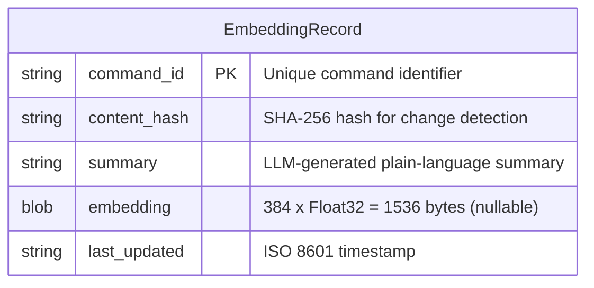

# CommandTree Specification

## Table of Contents

- [Overview](#overview)
- [Command Discovery](#command-discovery)
  - [Shell Scripts](#shell-scripts)
  - [NPM Scripts](#npm-scripts)
  - [Makefile Targets](#makefile-targets)
  - [Launch Configurations](#launch-configurations)
  - [VS Code Tasks](#vs-code-tasks)
  - [Python Scripts](#python-scripts)
- [Command Execution](#command-execution)
  - [Run in New Terminal](#run-in-new-terminal)
  - [Run in Current Terminal](#run-in-current-terminal)
  - [Debug](#debug)
- [Quick Launch](#quick-launch)
- [Tagging](#tagging)
  - [Tag Configuration File](#tag-configuration-file)
  - [Pattern Syntax](#pattern-syntax)
  - [Managing Tags](#managing-tags)
- [Filtering](#filtering)
  - [Text Filter](#text-filter)
  - [Tag Filter](#tag-filter)
  - [Clear Filter](#clear-filter)
- [Parameterized Commands](#parameterized-commands)
- [Settings](#settings)
  - [Exclude Patterns](#exclude-patterns)
  - [Sort Order](#sort-order)
  - [Show Empty Categories](#show-empty-categories)
- [User Data Storage](#user-data-storage)
- [Semantic Search](#semantic-search)
  - [Overview](#overview-1)
  - [LLM Integration](#llm-integration)
  - [Embedding Model](#embedding-model)
  - [Database](#database)
  - [Migration](#migration)
  - [Data Structure](#data-structure)
  - [Search UX](#search-ux)

---

## Overview
**overview**

CommandTree scans a VS Code workspace and surfaces all runnable commands in a single tree view sidebar panel. It discovers shell scripts, npm scripts, Makefile targets, VS Code tasks, launch configurations, etc then presents them in a categorized, filterable tree.

## Command Discovery
**command-discovery**

CommandTree recursively scans the workspace for runnable commands grouped by type. Discovery respects exclude patterns configured in settings. It does this in the background on low priority.

### Shell Scripts
**command-discovery/shell-scripts**

Discovers `.sh` files throughout the workspace. Supports optional `@param` and `@description` comments for metadata.

### NPM Scripts
**command-discovery/npm-scripts**

Reads `scripts` from all `package.json` files, including nested projects and subfolders.

### Makefile Targets
**command-discovery/makefile-targets**

Parses `Makefile` and `makefile` for named targets.

### Launch Configurations
**command-discovery/launch-configurations**

Reads debug configurations from `.vscode/launch.json`.

### VS Code Tasks
**command-discovery/vscode-tasks**

Reads task definitions from `.vscode/tasks.json`, including support for `${input:*}` variable prompts.

### Python Scripts
**command-discovery/python-scripts**

Discovers files with a `.py` extension.

## Command Execution
**command-execution**

Commands can be executed three ways via inline buttons or context menu.

### Run in New Terminal
**command-execution/new-terminal**

Opens a new VS Code terminal and runs the command. Triggered by the play button or `commandtree.run` command.

### Run in Current Terminal
**command-execution/current-terminal**

Sends the command to the currently active terminal. Triggered by the circle-play button or `commandtree.runInCurrentTerminal` command.

### Debug
**command-execution/debug**

Launches the command using the VS Code debugger. Only applicable to launch configurations. Triggered by the bug button or `commandtree.debug` command.

## Quick Launch
**quick-launch**

Users can star commands to pin them in a "Quick Launch" panel at the top of the tree view. Starred command identifiers are persisted in the `quick` array inside `.vscode/commandtree.json`:

```json
{
  "quick": [
    "npm:build",
    "shell:/path/to/project/scripts/deploy.sh:deploy.sh"
  ]
}
```

## Tagging
**tagging**

Tags group related commands for organization and filtering.

### Tag Configuration File
**tagging/config-file**

Tags are defined in `.vscode/commandtree.json` under the `tags` key:

```json
{
  "tags": {
    "build": ["npm:build", "npm:compile", "make:build"],
    "test": ["npm:test*", "Test:*"],
    "ci": ["npm:lint", "npm:test", "npm:build"]
  }
}
```

This file can be committed to version control to share command organization with a team.

### Pattern Syntax
**tagging/pattern-syntax**

| Pattern | Matches |
|---------|---------|
| `npm:build` | Exact match: npm script named "build" |
| `npm:test*` | Wildcard: npm scripts starting with "test" |
| `*deploy*` | Any command with "deploy" in the name |
| `type:shell:*` | All shell scripts |
| `type:npm:*` | All npm scripts |
| `type:make:*` | All Makefile targets |
| `type:launch:*` | All launch configurations |
| `**/scripts/**` | Path matching: commands in any `scripts` folder |
| `shell:/full/path:name` | Exact command identifier (used internally for Quick Launch) |

### Managing Tags
**tagging/management**

- **Add tag to command**: Right-click a command > "Add Tag" > select existing or create new
- **Remove tag from command**: Right-click a command > "Remove Tag"
- **Edit tags file directly**: Command Palette > "CommandTree: Edit Tags Configuration"

## Filtering
**filtering**

### Text Filter
**filtering/text**

Free-text filter via toolbar or `commandtree.filter` command. Matches against command names.

### Tag Filter
**filtering/tag**

Pick a tag from the toolbar picker (`commandtree.filterByTag`) to show only commands matching that tag's patterns.

### Clear Filter
**filtering/clear**

Remove all active filters via toolbar button or `commandtree.clearFilter` command.

## Parameterized Commands
**parameterized-commands**

Shell scripts with parameter comments prompt the user for input before execution:

```bash
#!/bin/bash
# @description Deploy to environment
# @param environment Target environment (staging, production)

deploy_to "$1"
```

VS Code tasks using `${input:*}` variables prompt automatically via the built-in input UI.

## Settings
**settings**

All settings are configured via VS Code settings (`Cmd+,` / `Ctrl+,`).

### Exclude Patterns
**settings/exclude-patterns**

`commandtree.excludePatterns` - Glob patterns to exclude from command discovery. Default includes `**/node_modules/**`, `**/.vscode-test/**`, and others.

### Sort Order
**settings/sort-order**

`commandtree.sortOrder` - How commands are sorted within categories:

| Value | Description |
|-------|-------------|
| `folder` | Sort by folder path, then alphabetically (default) |
| `name` | Sort alphabetically by command name |
| `type` | Sort by command type, then alphabetically |

### Show Empty Categories
**settings/show-empty-categories**

`commandtree.showEmptyCategories` - Whether to display category nodes that contain no discovered commands.

## User Data Storage
**user-data-storage**

CommandTree stores workspace-specific data in `.vscode/commandtree.json`. This file is automatically created and updated as you use the extension. It holds both Quick Launch pins and tag definitions.

---

## Semantic Search
**semantic-search**

### Overview
**semantic-search/overview**

CommandTree uses GitHub Copilot to generate a plain-language summary of what each discovered script does. These summaries are then embedded into 384-dimensional vectors using `all-MiniLM-L6-v2` (via `@huggingface/transformers`) and stored in a local SQLite database (via `node-sqlite3-wasm`). This enables **semantic search**: users can describe what they want in natural language and find the right script without knowing its exact name or path.

Hovering over any script in the tree displays the summary prominently in the tooltip.

Summaries get updated whenever the script changes. This is triggered through a file watch. When updates occur, the user is notified of the agent usage.

- File watch has a decent debounce window because multiple edits could happen rapidly. Some latency on updates is tolerable
- Summaries are created and stored as markdown
- Display is native VScode DOM
- If security warnings in scripts are discovered display a CRITICAL WARNING ⚠️

### LLM Integration
**semantic-search/llm-integration**

The preferred integration path is **GitHub Copilot** via the VS Code Language Model API (`vscode.lm`), which is stable since VS Code 1.90. Copilot generates plain-language summaries only. It does NOT generate embeddings or perform search ranking.

**Opt-in flow:**

⛔️ IGNORE FOR NOW. Will implement later.

**Alternative providers:**

⛔️ IGNORE FOR NOW. Will implement later.

### Embedding Model
**semantic-search/embedding-model**

Embeddings are generated locally using `@huggingface/transformers` with the `all-MiniLM-L6-v2` model:

- **384 dimensions** per embedding vector
- **~23 MB** model, downloaded on first use to `{workspaceFolder}/.commandtree/models/`
- **~10ms** per embedding on modern hardware
- **Pure JS/WASM** — no native binaries, works cross-platform
- Same model embeds both stored summaries and search queries for consistent vector space

VS Code has no stable embedding API (`vscode.lm.computeEmbeddings` is proposed-only and cannot be used in published extensions).

### Database
**semantic-search/database**

Summary records and vector embeddings are stored in a local SQLite database via `node-sqlite3-wasm`:

- **Location**: `{workspaceFolder}/.commandtree/commandtree.sqlite3`
- **Pure WASM** — no native compilation, ~1.3 MB, auto file persistence
- **Synchronous API** — no async overhead for reads

```sql
CREATE TABLE IF NOT EXISTS embeddings (
    command_id TEXT PRIMARY KEY,
    content_hash TEXT NOT NULL,
    summary TEXT NOT NULL,
    embedding BLOB,
    last_updated TEXT NOT NULL
);
```

The `embedding` column stores 384 Float32 values as a 1536-byte BLOB. It is nullable to support migrated records that haven't been embedded yet.

### Migration
**semantic-search/migration**

On activation, if a legacy `.vscode/commandtree-summaries.json` file exists, all records are imported into SQLite (with `embedding = NULL`). The JSON file is deleted after successful import. The next summarisation run detects NULL embeddings and generates them.

Quick Launch pins and tag definitions remain in `.vscode/commandtree.json` (migration to SQLite deferred to future work).

### Data Structure
**semantic-search/data-structure**



- **`content_hash`** — When a script file changes, the hash no longer matches and the summary + embedding are regenerated.
- **`embedding`** — A 384-dimensional Float32 vector produced by `all-MiniLM-L6-v2`. Stored as a BLOB. Used for cosine similarity search.
- **`summary`** — A short (1-3 sentence) description of what the script does, generated by GitHub Copilot.

### Search UX
**semantic-search/search-ux**

The existing filter bar (`commandtree.filter`) gains a semantic search mode:

1. User types a natural-language query (e.g. *"deploy to staging"*, *"run database migrations"*, *"lint and format code"*).
2. The query is embedded locally using `all-MiniLM-L6-v2` (~10ms).
3. Results are ranked by **cosine similarity** between the query embedding and each command's stored embedding.
4. The tree view updates to show matching commands, ordered by relevance score.

If no summaries have been generated (feature not enabled), the filter falls back to the existing text-match behaviour. If the embedding model is unavailable, a text-match fallback on summaries is used.
